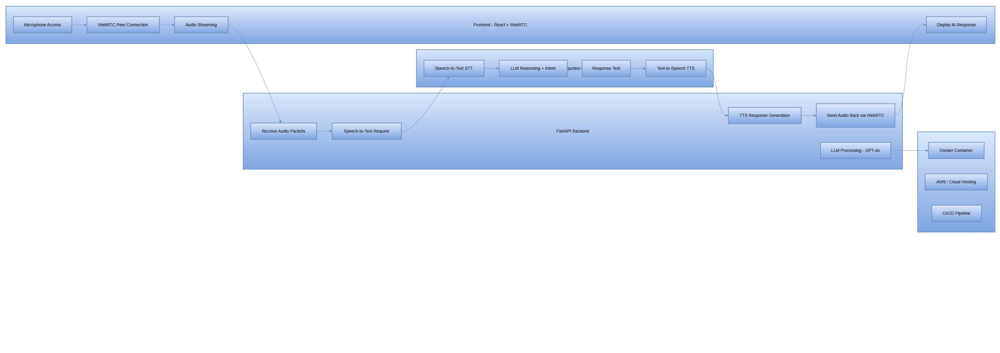

# System Architecture (Initial Version)

This project implements a real-time voice-enabled GenAI chatbot using FastAPI, WebRTC, and OpenAI.

Below is the initial architecture diagram illustrating the major components:

## Components Overview

### 1. Frontend (React + WebRTC)
- Captures microphone audio
- Establishes WebRTC peer connection
- Streams audio to the backend
- Displays AI responses in real time

### 2. FastAPI Backend
- Accepts incoming audio packets
- Streams data to OpenAI STT
- Sends transcribed text to LLM (OpenAI GPT-4o)
- Generates structured response
- Converts text-to-speech for playback
- Returns response audio over WebRTC

### 3. OpenAI Speech + LLM Pipeline
- Speech-to-text (STT)
- Intent detection & reasoning
- Response generation
- Optional RAG pipeline (coming soon)
- TTS output

### 4. Deployment (Planned)
- Docker-based containerization
- CI/CD pipeline
- Optional AWS deployment (ECS / EKS / Lambda)

More diagrams will be added as the project expands.
